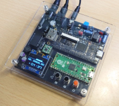

# MGSPICO3z 
2025/08/16 harumakkin

 **fig.1 MGSPICO3**

## これは何？
MGSPICO3zは以前製作した[MGSPICO3](https://github.com/cliffgraph/MGSPICO3)のZ80 CPUエミュレータ部分を、Z80 CPUコア[TV80](https://github.com/hutch31/tv80)に変更したバージョンです。MGSPICO3ではRaspberryPiPico2内で、音源ドライバMGSDRVとKINROU5を自作Z80エミュレーター上で動作させ、TangNano9K内の音源チップコアにアクセスしてMGS、MuSICA の楽曲を演奏する仕組みでした。
MGSPICO3zではTangNano9K内に、Z80 CPU(TV80)を実装しMGSDRVとKINROU5による演奏を行うようになりました。RaspberryPiPico2側はSDカードから楽曲ファイルをTangNano9Kへ転送したりOLEDや操作スイッチのUI部分を担当したりするのみとなりました。現状、MGSPICO3zはMGSPICO3の機能を完全に移植できていません（TGFファイル、VGMファイルの再生はできません）。v3.2.0より、NDPの再生にも対応しました。

## 使い方
### 用意するもの
- MGSPICO3
- [MGSDRV.COM(Ver3.20)](https://gigamix.jp/mgsdrv/)
- MGS楽曲データファイル（.MGSファイル）
- [KINROU5.DRV(Ver2.00)](https://sakuramail.net/fswold/music.html#muskin)
- MuSICA楽曲データファイル（.BGMファイル）
- [NDP.BIN(Ver1.03)](https://ndp.squares.net/web/)
- NDP楽曲データファイル（.NDPファイル）
- microSD カード
- DC5V電源(センタープラス 2.1mm DCプラグ）

### 書き込みソフトウェア
- Raspberry Pi Pico 2にインストールするファイルは、dist/mgspico3z_firmware_v3.xx/mgspico3z.uf2 です
- TangNano9Kに書き込むファイルは、dist/mgspico3z_firmware_v3.xx/HALMEM.fs です

### microSD カードの準備、セットアップ
- microSD カードの準備
- microSDカードを用意します。（32GBの容量の物で動作確認しています、それ以外では行っていません）
- microSDカードを、FAT、もしくは、FAT32フォーマットを施します。
- microSDカードに、MGSDRV.COM をコピーします また、MuSICAデータも鑑賞したい場合は、KINROU5.DRVもコピーします。
- （MGSPICO3以前に必要でした、player.com、playerK.comは必要ありません）
- 鑑賞したいMGSデータファイル(.MGS)、MuSICAデータファイル(.BGM)もカードへコピーします（それぞれ1000ファイルまで）

## 操作方法
- [MGSPICO](https://github.com/cliffgraph/MGSPICO)と同様です。が、下記が異なります。
##### ランダム再生のＯＮ／ＯＦＦ
- 演奏中に、●SWを押しながら▼を押すとランダム再生機能がＯＮされます。もう一度同じ操作を行うとＯＦＦされます。（▼と▲の同時押しは廃止されました）
##### Z80 CPU負荷の表示
- ●SWを押しながら▲を押すと、Z80 CPU負荷表示画面に切り替わります。
- 左上に表示される数字はZ80 CPUとは関係なく、OLED表示のリフレッシュレートを表しています。通常63です
- １画面分で過去約２秒間の状態をグラフ表示します。
- このグラフバーは、MGSDRV、KINROU5、NDPの一回の呼び出しにかかった時間そのものを表していて、処理時間がかかれば白い線が長く表示れます。リフレッシュレートの下の横線は、16.6msを表しています。横線を超えるバーが表示される場合は、MGSDRV、KINROU5、NDPの一回の呼び出しに16.6ms以上を要したことを示しています。

# LICENSEと利用に関する注意事項
1. MGSPICO3z のファームウェアとそのソースコード、回路図データおよび資料ファイルは MIT License で配布されます。ただし、MGSPICO3z は、FatFsと8x16文字フォントを使用しています。FatFs/8x16文字フォントのソースコードの扱いに関しては各々のLICENSEに従ってください。
2. 本作品は同人ハードウェア＆ソフトウェアです。本作品の設計およびソフトウェアは品質を保証していません。音源カートリッジや音響設備、その周辺機器が故障、破損したとしても自身で責任を負える方のみ本作品をご利用ください。特にハードウェアの製作を伴いますのでリスクがあります。製作の腕に自身のある方のみご利用ください。
3. 本作品の設計資料とソースコードの改変や改造、また、別の作品への利用、商用利用は自由です。ただし、1. 2.の制限を超える利用は各自でその責任と義務を負ってください。

### MGSPICO3zが組込利用しているソフトウェア(PICO-SDK以外)
- FatFs Copyright (C) 20xx, ChaN, all right reserved. http://elm-chan.org/fsw/ff/00index_e.html
- 8x16 文字フォント FONT8X16MIN.h https://github.com/askn37/OLED_SSD1306
- wave_table_sound Copyright (c) 2021 HRA!. https://github.com/hra1129/wave_table_sound 
- IKAOPLL Copyright (c) 2023, Raki. https://github.com/ika-musume/IKAOPLL
- IKASCC Copyright (c) 2023, Raki. https://github.com/ika-musume/IKASCC
- ym2149_audio Copyright (c) 2020, Matthew Hagerty. https://github.com/dnotq/ym2149_audio
- TV80 Copyright (c) 2004 Guy Hutchison. https://github.com/hutch31/tv80

### 起動時に読み込んで使用しているソフトウェア
- MGSDRV
(C) Ain./Gigamix https://gigamix.jp/mgsdrv/
- 勤労５号（MuSICA互換ドライバ）
(C) 1996,1997 Keiichi Kuroda / BTO(MuSICA Laboratory) All rights reserved. https://sakuramail.net/fswold/music.html#muskin
- NDP (PSG Driver for MSX)
Programmed by naruto2413 https://ndp.squares.net/web/

## 修正履歴
|date|firmware|note|
|:--|:--|:--|
|2025/08/16|mgspico3z_firmware_v3.3.1|●不具合修正: loop cnt.1 設定の時に、２番目に再生された曲がすぐにフェードアウトしてしまう不具合を修正した|
|2025/08/13|mgspico3z_firmware_v3.3.0|●機能修正:・SDカード内のサブディレクトリに対応した ・SETTINGで１曲のloop回数を、無限、1、2、3の４種類から選択できるようにした ・SETTINGの保存ファイル名を変更した。MGSPICO.DAT　→　MGSPIC3Z.DAT ・そのほかリファクタリングやFPGAコードの改良 |
|2025/06/26|mgspico3z_firmware_v3.2.2|●機能修正: ・曲切替時の、フェードアウトの音量変更を音源ドライバのボリューム設定ではなく、MIX回路内で行うようにした ・他、軽微な修正|
|2025/05/31|mgspico3z_firmware_v3.2.1|●不具合修正: NDP楽曲でループする曲を自動終了できなかったのを改善した|
|2025/05/25|mgspico3z_firmware_v3.2.0|●機能追加: 音源ドライバ NDPに対応しました。NDP楽曲データファイルは.NDP拡張子をつけてください|
|2025/03/26|mgspico3z_firmware_v3.1.0|●機能追加: TV80のクロックを3.58MHzと7.16MHzの二つから選べるようにしました。（[●]ボタンを押しながら電源ONでセッティング画面が起動します。セッティング画面から抜けるには[●]ボタンを長押しします。） ●bugfix: 演奏が終了し次の曲を再生するときまれに再生しないことがある不具合を修正しました。|
|2025/03/02|mgspico3z_firmware_v3.00|初版|

## 各MGSPICOでサポートしている楽曲データ形式
MGSPICO3zのみ、tgf、VGMデータには対応できていません。 
|Model|MGS|MuSICA|NDP|tgf|VGM|
|:--|:-:|:-:|:-:|:-:|:-:|
|MGSPICO|✓|✓|✓|✓|✓|
|MGSPICO 2|✓|✓|✓|✓|✓|
|MGSPICO 3|✓|✓|✓|✓|✓|
|MGSPICO 3z|✓|✓|✓|-|-|

